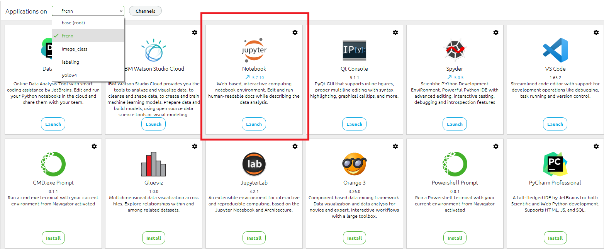
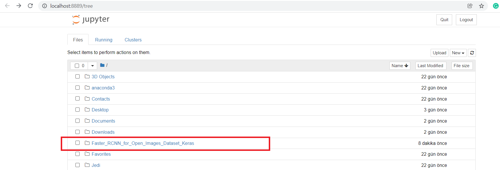
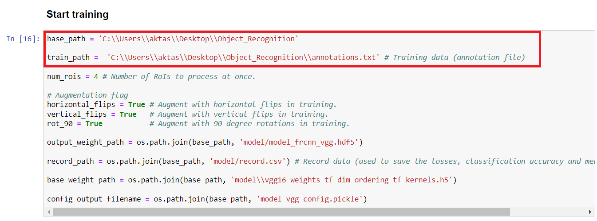
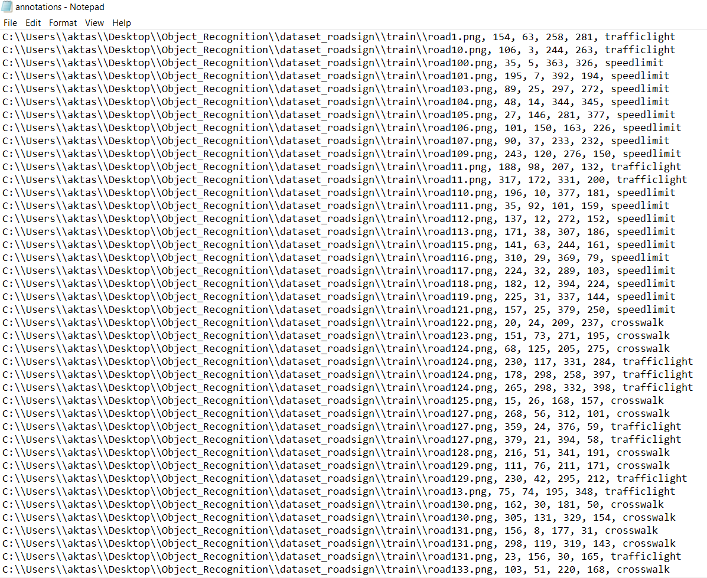
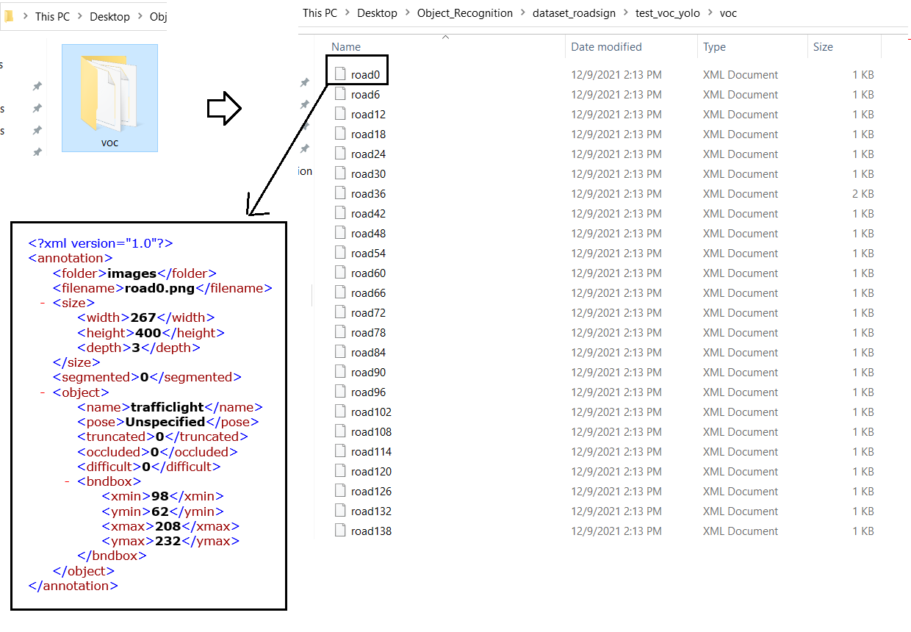
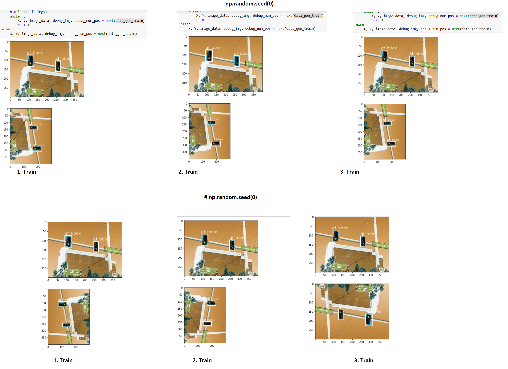
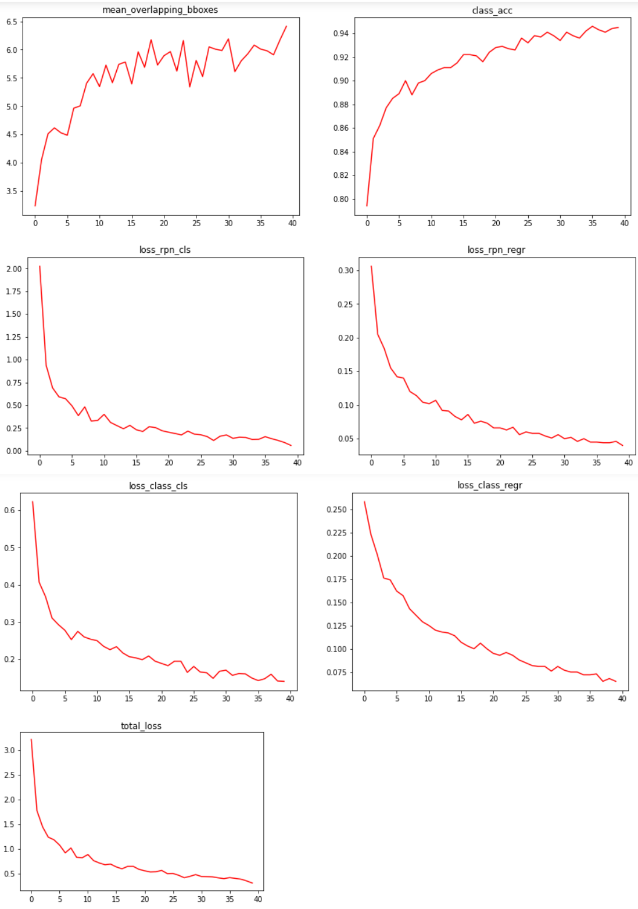
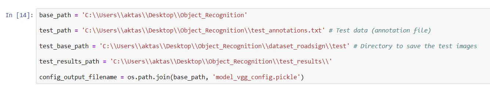
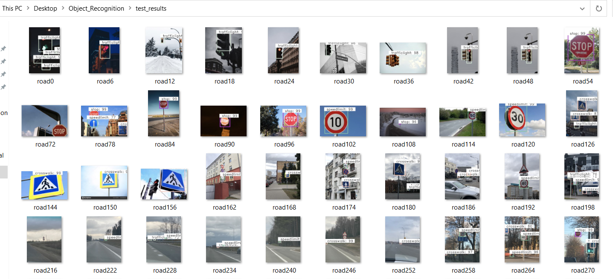

# Faster R-CNN for Custom Object Detection

The forked respository for Faster RCNN implementation. In this document, build instructions and usage of the repo will be explained.

# Build Instructions

Since this is a source code implemented in jupyter notebook I suggest you to create an Anaconda Environment and use Jupyter Notebook from this tool.

In this essence follow the below steps:

* Download Anaconda ->  https://www.anaconda.com/products/individual 
* clone this repo -> git clone https://github.com/YCAyca/Faster_RCNN_for_Open_Images_Dataset_Keras.git 
* Create envrionment with the dependendices necessary for this repo   
    * open anaconda terminal  
    * cd path_to_requirement.txt_folder  
    * conda env create -f environment.txt -n frcnn anaconda   
    * activate frcnn  
    * pip install pandas  
    * pip install matplotlib  

* Now your environment is ready to use, open Anaconda tool, open your envrinment and select jupyter notebook, open the repo you cloned  
 
 

# Train your Custom Model

* Open <b> frcnn_train_vgg.pynb <\b>
* Change base paths for your dataset  
  
* The annotation file should be 1 file having filename, xmin, xmax, ymin, ymax, class_name info for each pbject labeled in your dataset.  
  
* <b> If you have a classical type of Pascal/VOC annotation files where each image has its own .xml annotation file, you can use combine_annotations.py script in this repo to obtain the appropriate annotation file for training. Just collect all your annotation files in one folder and run the script with appropriate path </b>  
 

* Before start training, if you want to see the augmented images the new bounding boxes (highly recommended!), put global <b> visualize_data variable to True </b>, if not, leave it in default stage False.

* If you want to obtain same augmentation every time, (I prefer this to see the real effect of the changes I did on parameters for different experiments), leave np.random.seed(0) line as default. If you want random - different augmentation on your dataset for every time you train the model from the beginning, comment out this line.    

* Download pretrained weights for vgg (taken from source repo!) : https://drive.google.com/file/d/1FoKDz5N_PZUwcBu1DzjnD7t7c3w5v37p/view 

You are ready to train now!
At the end of the training, you will get the total amount of time passed, loss and accuracy diagrams for both classifier and region proposl network (rpn) as below

 

Also you will obtain your trained model (model_frcnn_vgg.hdf5), a record file for the training process and a pickle file to be used in test. 

# Test your Custom Model

* Similar to the training process, change your base path for your test dataset and their annotation file. The dataset will be sent to the model to make predictions and the annotation file is to calculate mAP. 

 

* Also in test_results_path folder, you will obtain your test results with their bounding boxes.

 

 

 
